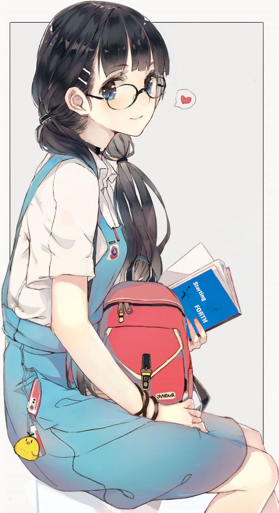
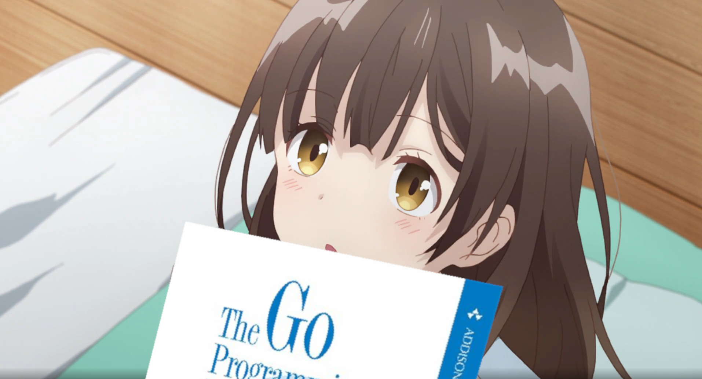
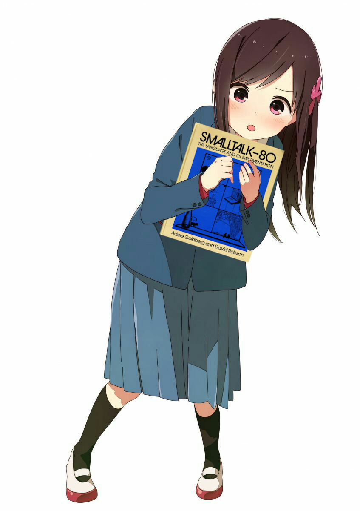
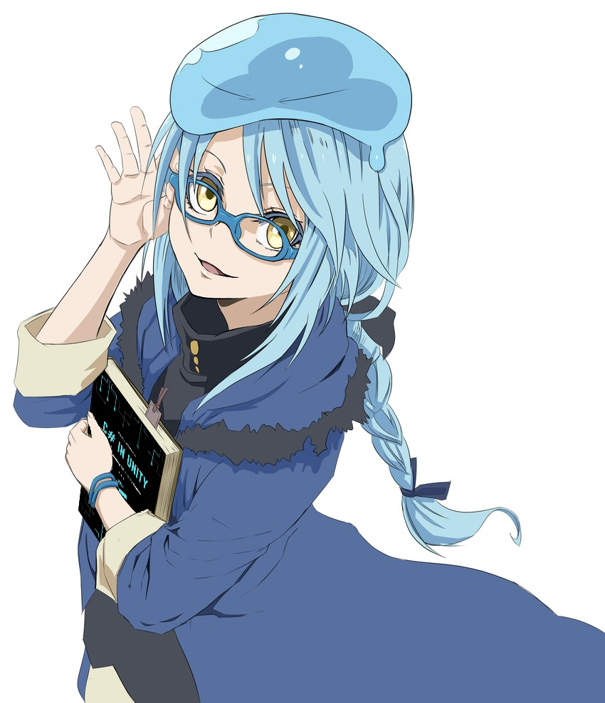

# Anime-Girls-Holding-Programming-Books-API

Simple API using the repo [Anime-Girls-Holding-Programming-Books](https://github.com/cat-milk/Anime-Girls-Holding-Programming-Books) idk why i made it

## Setup

#### Git clone the repo

    git clone https://github.com/feijoes/AnimeGirls-with-Books-API.git

End enter the folder

    cd AnimeGirls-with-Books-API

#### Install the dependecies

    npm install

#### Run

    npm start

## Current Folders
Name | Len folder | Example 
 --- | :---: | :---:  
| `ABAP`|2|  
| `Ada`|1|  
| `Agda`|2|  
| `AI`|8|  
| `Algorithms`|12|  
| `APL`|1|  
| `Architecture`|4|  
| `ASM`|5|  
| `Beef`|1|  
| `C`|57|  
| `C#`|8|  
| `C++`|29|  
| `Cobol`|3|  
| `Compilers`|5|  
| `CSS`|1|  
| `D`|1|  
| `Dart`|4|  
| `Delphi`|1|  
| `Design Patterns`|4|  
| `Editors`|5|  
| `Elixir`|4|  
| `Elm`|1|  
| `F#`|3|  
| `FORTH`|1|  
| `Fortran`|1|  
| `GDScript`|1|  
| `Go`|5|  
| `Haskell`|14|  
| `HolyC`|3|  
| `HoTT`|4|  
| `Idris`|1|  
| `Java`|16|  
| `Javascript`|22|  
| `Kotlin`|5|  
| `Linux`|2|  
| `Lisp`|4|  
| `Lua`|10|  
| `Math`|14|  
| `Memes`|7|  
| `Mixed`|3|  
| `MongoDB`|1|  
| `Nim`|1|  
| `NodeJs`|2|  
| `Objective-C`|2|  
| `OCaml`|2|  
| `Other`|17|  
| `Perl`|6|  
| `Personification`|3|  
| `PHP`|9|  
| `Prolog`|1|  
| `Python`|31|  
| `Quantum Computing`|2|  
| `R`|3|  
| `Racket`|1|  
| `RayTracing`|1|  
| `ReCT`|1|  
| `Regex`|2|  
| `Ruby`|12|  
| `Rust`|24|  
| `Scala`|2|  
| `Shell`|1|  
| `SICP`|95|  
| `Smalltalk`|1|  
| `Solidity`|1|  
| `SQL`|1|  
| `Swift`|2|  
| `Systems`|8|  
| `Typescript`|5|  
| `Uncategorized`|6|  
| `Unity`|1|  
| `Unreal`|1|  
| `V`|3|  
| `Verilog`|2|  
| `VHDL`|1|  
| `Visual Basic`|1|  
| `WebGL`|1|  
