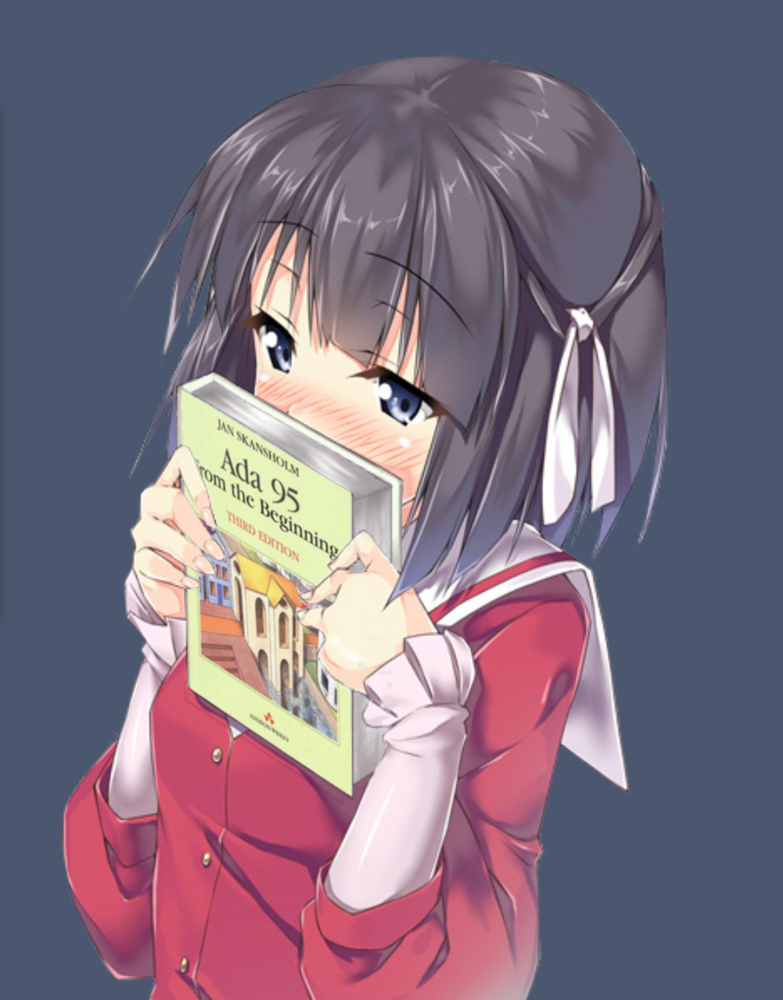
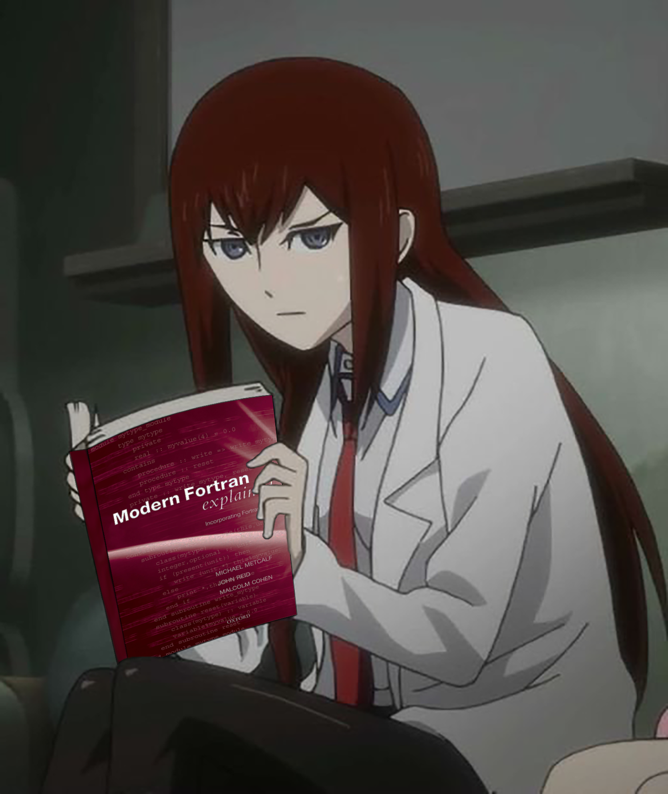
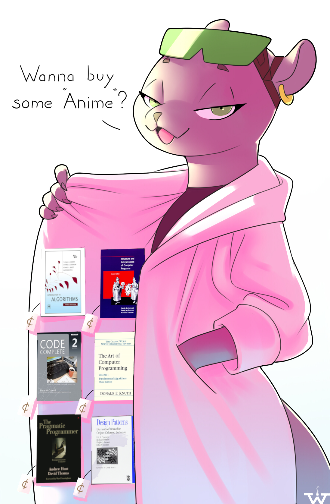
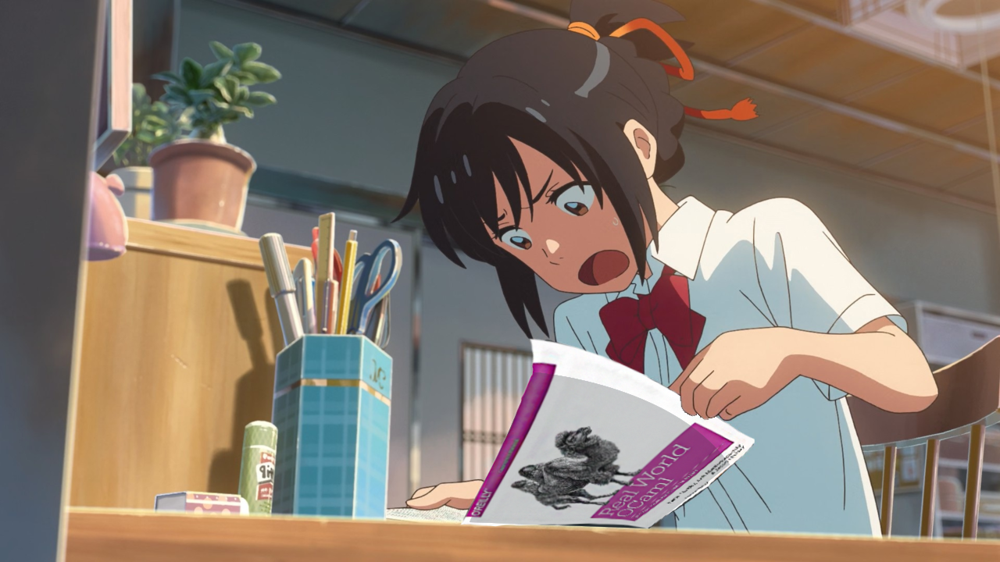
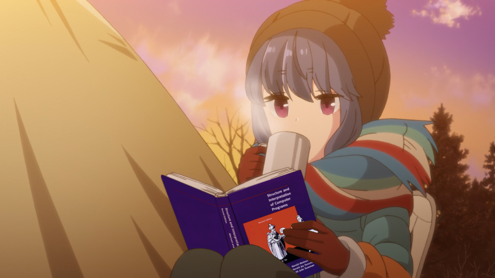
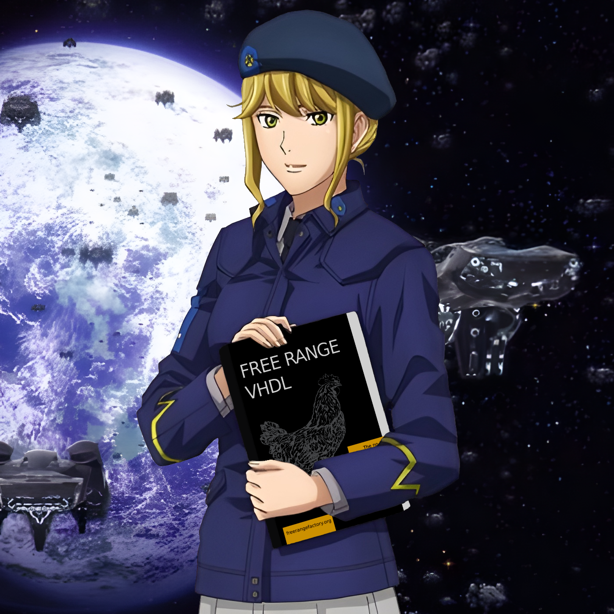

# Anime-Girls-Holding-Programming-Books-API

Simple API using the repo [Anime-Girls-Holding-Programming-Books](https://github.com/cat-milk/Anime-Girls-Holding-Programming-Books) idk why i made it

## API GUIDE

Go to `http://localhost:3000/` , you will see JSON like this thats show the names and the numbers of images in that folder

### Also you can see in [Current Folders](#CurrentFolders) section

#### If you go to `http://localhost:3000/api/` will display a random image

## Setup

#### Git clone the repo

    git clone https://github.com/feijoes/AnimeGirls-with-Books-API.git

End enter the folder

    cd AnimeGirls-with-Books-API

#### Install the dependecies

    npm install

#### Run

    npm start
    

## <a name="CurrentFolders">Current Folders</a> 
Name | Len folder | Example 
 --- | :---: | :---:  
| `ABAP`|2|  
| `Ada`|1|  
| `Agda`|2|  
| `AI`|8|  
| `Algorithms`|12|  
| `APL`|1|  
| `Architecture`|4|  
| `ASM`|5|  
| `Beef`|1|  
| `C`|57|  
| `C++`|29|  
| `CHashtag`|8|  
| `Cobol`|3|  
| `Compilers`|5|  
| `CSS`|1|  
| `D`|1|  
| `Dart`|4|  
| `Delphi`|1|  
| `Design Patterns`|4|  
| `Editors`|5|  
| `Elixir`|4|  
| `Elm`|1|  
| `FHashtag`|3|  
| `FORTH`|1|  
| `Fortran`|1|  
| `GDScript`|1|  
| `Go`|5|  
| `Haskell`|14|  
| `HolyC`|3|  
| `HoTT`|4|  
| `Idris`|1|  
| `Java`|16|  
| `Javascript`|22|  
| `Kotlin`|5|  
| `Linux`|2|  
| `Lisp`|4|  
| `Lua`|10|  
| `Math`|14|  
| `Memes`|7|  
| `Mixed`|3|  
| `MongoDB`|1|  
| `Nim`|1|  
| `NodeJs`|2|  
| `Objective-C`|2|  
| `OCaml`|2|  
| `Other`|17|  
| `Perl`|6|  
| `Personification`|3|  
| `PHP`|9|  
| `Prolog`|1|  
| `Python`|31|  
| `Quantum Computing`|2|  
| `R`|3|  
| `Racket`|1|  
| `RayTracing`|1|  
| `ReCT`|1|  
| `Regex`|2|  
| `Ruby`|12|  
| `Rust`|24|  
| `Scala`|2|  
| `Shell`|1|  
| `SICP`|95|  
| `Smalltalk`|1|  
| `Solidity`|1|  
| `SQL`|1|  
| `Swift`|2|  
| `Systems`|8|  
| `Typescript`|5|  
| `Uncategorized`|6|  
| `Unity`|1|  
| `Unreal`|1|  
| `V`|3|  
| `Verilog`|2|  
| `VHDL`|1|  
| `Visual Basic`|1|  
| `WebGL`|1|  

| Name                | Len folder |                                                             Example                                                             |
| ------------------- | :--------: | :-----------------------------------------------------------------------------------------------------------------------------: |
| `ABAP`              |     2      |                                                          |
| `Ada`               |     1      |                                  |
| `Agda`              |     2      |                                                                  |
| `AI`                |     8      |                                                                         |
| `Algorithms`        |     12     |                      |
| `APL`               |     1      |                                                                             |
| `Architecture`      |     4      |                      |
| `ASM`               |     5      |                         |
| `Beef`              |     1      |                                                                  |
| `C`                 |     57     |                                   |
| `C#`                |     8      |                                         |
| `C++`               |     29     |                                                                       |
| `Cobol`             |     3      |                                               |
| `Compilers`         |     5      |                                      |
| `CSS`               |     1      |                                                    |
| `D`                 |     1      |                                               |
| `Dart`              |     4      |                                                        |
| `Delphi`            |     1      |                                                        |
| `Design Patterns`   |     4      |                                    |
| `Editors`           |     5      |                                                                   |
| `Elixir`            |     4      |                                            |
| `Elm`               |     1      |                                                            |
| `F#`                |     3      |                                            |
| `FORTH`             |     1      |                                 |
| `Fortran`           |     1      |                                             |
| `GDScript`          |     1      |                                                                   |
| `Go`                |     5      |                                                |
| `Haskell`           |     14     |                                              |
| `HolyC`             |     3      |                                |
| `HoTT`              |     4      |                                                                |
| `Idris`             |     1      |                                         |
| `Java`              |     16     |                                                               |
| `Javascript`        |     22     |                                |
| `Kotlin`            |     5      |                                                                  |
| `Linux`             |     2      |                                                  |
| `Lisp`              |     4      |                                              |
| `Lua`               |     10     |                                                     |
| `Math`              |     14     |                                                          |
| `Memes`             |     7      |                                                                  |
| `Mixed`             |     3      |                                             |
| `MongoDB`           |     1      |                                                     |
| `Nim`               |     1      |                                                            |
| `NodeJs`            |     2      |                                              |
| `Objective-C`       |     2      |                                                        |
| `OCaml`             |     2      |                                                    |
| `Other`             |     17     |                                                  |
| `Perl`              |     6      |                                                               |
| `Personification`   |     3      |                                                           |
| `PHP`               |     9      |                                                             |
| `Prolog`            |     1      |                                                      |
| `Python`            |     31     |                                |
| `Quantum Computing` |     2      |        |
| `R`                 |     3      |                                        |
| `Racket`            |     1      |                                                                    |
| `RayTracing`        |     1      |                                              |
| `ReCT`              |     1      |                                                         |
| `Regex`             |     2      |                                                      |
| `Ruby`              |     12     |                          |
| `Rust`              |     24     |                                  |
| `Scala`             |     2      |                                        |
| `Shell`             |     1      |                                                        |
| `SICP`              |     95     |                                                                |
| `Smalltalk`         |     1      |                                                       |
| `Solidity`          |     1      |                                                                 |
| `SQL`               |     1      |                                        |
| `Swift`             |     2      |                                               |
| `Systems`           |     8      |                      |
| `Typescript`        |     5      |                               |
| `Uncategorized`     |     6      |                                        |
| `Unity`             |     1      |                                                                 |
| `Unreal`            |     1      |                                                                    |
| `V`                 |     3      |                                                                  |
| `Verilog`           |     2      |  |
| `VHDL`              |     1      |                                           |
| `Visual Basic`      |     1      |                                                    |
| `WebGL`             |     1      |                     |

| Name                | Len folder |                                                          Example                                                          |
| ------------------- | :--------: | :-----------------------------------------------------------------------------------------------------------------------: |
| `ABAP`              |     2      |                                                    |
| `Ada`               |     1      |                            |
| `Agda`              |     2      |                                                            |
| `AI`                |     8      |                                                              |
| `Algorithms`        |     12     |                                |
| `APL`               |     1      |                                                                       |
| `Architecture`      |     4      |                |
| `ASM`               |     5      |                                                             |
| `Beef`              |     1      |                                                            |
| `C`                 |     57     |                                        |
| `C#`                |     8      |                                 |
| `C++`               |     29     |                                       |
| `Cobol`             |     3      |                                         |
| `Compilers`         |     5      |                                   |
| `CSS`               |     1      |                                              |
| `D`                 |     1      |                                         |
| `Dart`              |     4      |                                       |
| `Delphi`            |     1      |                                                  |
| `Design Patterns`   |     4      |                                          |
| `Editors`           |     5      |                                             |
| `Elixir`            |     4      |                                      |
| `Elm`               |     1      |                                                      |
| `F#`                |     3      |                                      |
| `FORTH`             |     1      |                           |
| `Fortran`           |     1      |                                       |
| `GDScript`          |     1      |                                                             |
| `Go`                |     5      |                                      |
| `Haskell`           |     14     |                                                  |
| `HolyC`             |     3      |                                                     |
| `HoTT`              |     4      |                                                          |
| `Idris`             |     1      |                                   |
| `Java`              |     16     |                                                         |
| `Javascript`        |     22     |                                   |
| `Kotlin`            |     5      |                                                                |
| `Linux`             |     2      |                                                        |
| `Lisp`              |     4      |                  |
| `Lua`               |     10     |                                                 |
| `Math`              |     14     |                                    |
| `Memes`             |     7      |                                                            |
| `Mixed`             |     3      |                                         |
| `MongoDB`           |     1      |                                               |
| `Nim`               |     1      |                                                      |
| `NodeJs`            |     2      |                                        |
| `Objective-C`       |     2      |                                                  |
| `OCaml`             |     2      |                                              |
| `Other`             |     17     |                                           |
| `Perl`              |     6      |                                                    |
| `Personification`   |     3      |                                                     |
| `PHP`               |     9      |                                               |
| `Prolog`            |     1      |                                                |
| `Python`            |     31     |                                                         |
| `Quantum Computing` |     2      |  |
| `R`                 |     3      |                                  |
| `Racket`            |     1      |                                                              |
| `RayTracing`        |     1      |                                        |
| `ReCT`              |     1      |                                                   |
| `Regex`             |     2      |                                                |
| `Ruby`              |     12     |                                                                |
| `Rust`              |     24     |                                       |
| `Scala`             |     2      |                                  |
| `Shell`             |     1      |                                                  |
| `SICP`              |     95     |                                                      |
| `Smalltalk`         |     1      |                                                 |
| `Solidity`          |     1      |                                                           |
| `SQL`               |     1      |                                  |
| `Swift`             |     2      |                                         |
| `Systems`           |     8      |                                           |
| `Typescript`        |     5      |                         |
| `Uncategorized`     |     6      |                                           |
| `Unity`             |     1      |                                                           |
| `Unreal`            |     1      |                                                              |
| `V`                 |     3      |                                  |
| `Verilog`           |     2      |                                                             |
| `VHDL`              |     1      |                                     |
| `Visual Basic`      |     1      |                                              |
| `WebGL`             |     1      |               |
